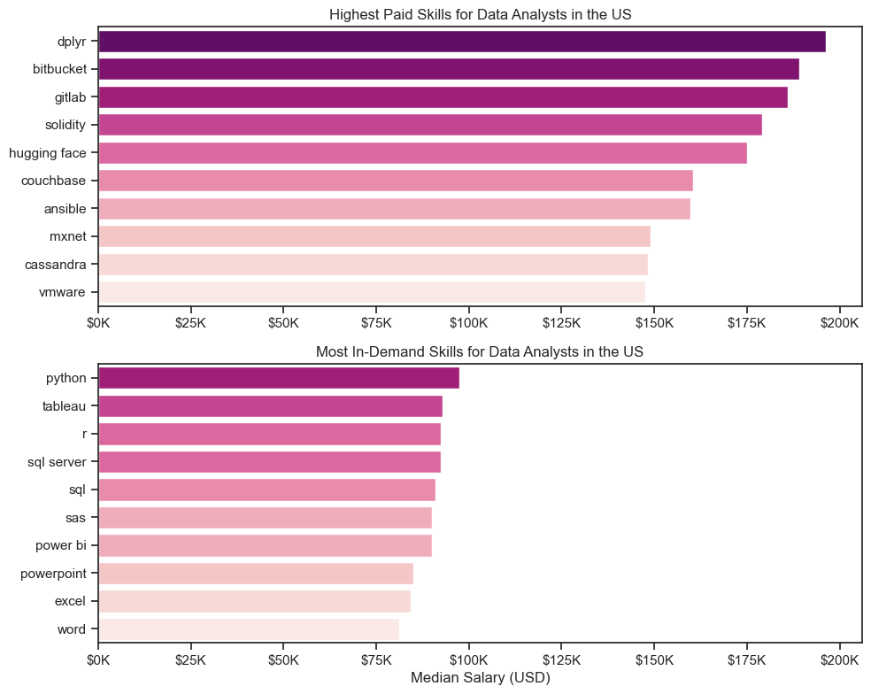

# The Analysis
## 1. What are the most demanded skills for the top 3 most popular data roles 
To find the most demande dskills for the top 3 most popular data roles. I filtered out those positions by which ones were the most popular, and got the top 5 skills for these top 3 roles. This query highlights the most popular job titles and their top skills, showing which skills I should pat attention to depending on the role I'm targeting. 

View my notebook with detailed steps here: [2_Skills_Demand.ipynb](3_Project/2_Skills_Count.ipynb) 

### Visualize Data 
```python
fig, ax = plt.subplots(len(job_titles), 1)


for i, job_title in enumerate(job_titles):
    df_plot = df_skills_perc[df_skills_perc['job_title_short'] == job_title].head(5)[::-1]
    sns.barplot(data=df_plot, x='skill_percent', y='job_skills', ax=ax[i], hue='skill_count', palette='dark:b_r')

plt.show() 
```
### Results 
![Chart of Top Skills for Data Jobs}(3_Project/pictures /output.png)

Bar graph visualizing the salary for the top 3 data roles and their top 5 skills associated with each.


# Insights:

- SQL is the most requested skill for Data Analysts and Data Scientists, with it in over half the job postings for both roles. For Data Engineers, Python is the most sought-after skill, appearing in 68% of job postings.
- Data Engineers require more specialized technical skills (AWS, Azure, Spark) compared to Data Analysts and Data Scientists who are expected to be proficient in more general data management and analysis tools (Excel, Tableau).
- Python is a versatile skill, highly demanded across all three roles, but most prominently for Data Scientists (72%) and Data Engineers (65%).

## 2. How are in-demand skills trending for Data Analysts?

To find how skills are trending in 2023 for Data Analysts, I filtered data analyst positions and grouped the skills by the month of the job postings. This got me the top 5 skills of data analysts by month, showing how popular skills were throughout 2023.

View my notebook with detailed steps here: [3_Skills_trend.ipynb](3_Project/3_Skills_trend.ipynb) 

## Visualize Data
```python
from matplotlib.ticker import PercentFormatter

df_plot = df_DA_US_percent.iloc[:, :5]
sns.lineplot(data=df_plot, dashes=False, legend='full', palette='tab10')

plt.gca().yaxis.set_major_formatter(PercentFormatter(decimals=0))

plt.show()
```
## Results 

*Bar graph visualizing the trending top skills for data analysts in the US in 2023.*

## Insights:

- SQL remains the most consistently demanded skill throughout the year, although it shows a gradual decrease in demand.
- Excel experienced a significant increase in demand starting around September, surpassing both Python and Tableau by the end of the year.
- Both Python and Tableau show relatively stable demand throughout the year with some fluctuations but remain essential skills for data analysts. Power BI, while less demanded compared to the others, shows a slight upward trend towards the year's end.

# 3. How well do jobs and skills pay for Data Analysts?

To identify the highest-paying roles and skills, I only got jobs in the United States and looked at their median salary. But first I looked at the salary distributions of common data jobs like Data Scientist, Data Engineer, and Data Analyst, to get an idea of which jobs are paid the most.

View my notebook with detailed steps here: [4_Project_Analysis.ipynb](3_Project/4_Project_Analysis.ipynb)

Visualize Data

```python
sns.boxplot(data=df_US_top6, x='salary_year_avg', y='job_title_short', order=job_order)

ticks_x = plt.FuncFormatter(lambda y, pos: f'${int(y/1000)}K')
plt.gca().xaxis.set_major_formatter(ticks_x)
plt.show()
```
## Results 


## Insights

- There's a significant variation in salary ranges across different job titles. Senior Data Scientist positions tend to have the highest salary potential, with up to $600K, indicating the high value placed on advanced data skills and experience in the industry.

- Senior Data Engineer and Senior Data Scientist roles show a considerable number of outliers on the higher end of the salary spectrum, suggesting that exceptional skills or circumstances can lead to high pay in these roles. In contrast, Data Analyst roles demonstrate more consistency in salary, with fewer outliers.

- The median salaries increase with the seniority and specialization of the roles. Senior roles (Senior Data Scientist, Senior Data Engineer) not only have higher median salaries but also larger differences in typical salaries, reflecting greater variance in compensation as responsibilities increase.

## Highest Paid & Most Demanded Skills for Data Analysts

Next, I narrowed my analysis and focused only on data analyst roles. I looked at the highest-paid skills and the most in-demand skills. I used two bar charts to showcase these.

```Python

fig, ax = plt.subplots(2, 1)  

# Top 10 Highest Paid Skills for Data Analysts
sns.barplot(data=df_DA_top_pay, x='median', y=df_DA_top_pay.index, hue='median', ax=ax[0], palette='dark:b_r')

# Top 10 Most In-Demand Skills for Data Analystsr')
sns.barplot(data=df_DA_skills, x='median', y=df_DA_skills.index, hue='median', ax=ax[1], palette='light:b')

plt.show()
```
## Results 
Here's the breakdown of the highest-paid & most in-demand skills for data analysts in the US:



## Insights
Insights:

- The top-paying skills for Data Analysts in the US are heavily tied to specialized technologies such as dplyr, bitbucket, and gitlab, with median salaries reaching close to $200K. Skills related to cloud technologies and advanced frameworks like hugging face and couchbase also command high salaries, showing the increasing value of niche technical expertise.
- In contrast, the most in-demand skills for Data Analysts are much more traditional and foundational. Skills like Python, Tableau, SQL, and Excel dominate job postings, but their median salaries are more moderate, typically ranging between $50K and $100K. This suggests that while these skills are essential for most analyst roles, they are more common and therefore slightly less compensated compared to niche skills.
- Overall, the charts highlight a trade-off between demand and salary: highly specialized technical skills offer significantly higher earning potential, while broadly used tools like Excel and PowerPoint are in demand but associated with lower median salaries. This underscores the importance of blending foundational skills with specialized expertise to maximize career opportunities and salary growth.

## 4. What are the most optimal skills to learn for Data Analysts?

To identify the most optimal skills to learn ( the ones that are the highest paid and highest in demand) I calculated the percent of skill demand and the median salary of these skills. To easily identify which are the most optimal skills to learn.

View my notebook with detailed steps here: [5_Optimal_Skills.ipynb](3_Project/5_Optimal_Skills.ipynb)

## Visualize Data
```Python
from adjustText import adjust_text
import matplotlib.pyplot as plt

plt.scatter(df_DA_skills_high_demand['skill_percent'], df_DA_skills_high_demand['median_salary'])
plt.show()
```
Results


## Insights: 

- The skill Oracle appears to have the highest median salary of nearly $97K, despite being less common in job postings. This suggests a high value placed on specialized database skills within the data analyst profession.

- More commonly required skills like Excel and SQL have a large presence in job listings but lower median salaries compared to specialized skills like Python and Tableau, which not only have higher salaries but are also moderately prevalent in job listings.

- Skills such as Python, Tableau, and SQL Server are towards the higher end of the salary spectrum while also being fairly common in job listings, indicating that proficiency in these tools can lead to good opportunities in data analytics.

